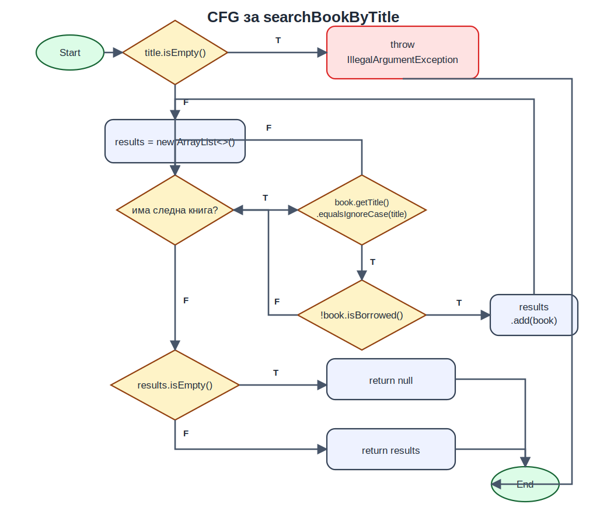
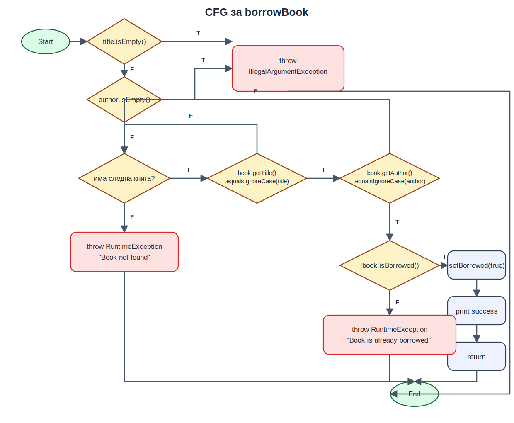

# Столе Кршков 221197

## Control Flow Graph

### `searchBookByTitle`

### `borrowBook`

## Цикломатска комплексност

При пресметката краткоспојните оператори `&&` и `||` ги третирам како посебни одлуки во CFG, бидејќи така реално се разгранува извршувањето.

### `searchBookByTitle`

Во [src/main/java/SI2026Lab2Main.java](src/main/java/SI2026Lab2Main.java) функцијата е на линии `54-68`.

Предикатни јазли:

1. `title.isEmpty()` на линија `55`
2. `for (Book book : books)` на линија `59`
3. `book.getTitle().equalsIgnoreCase(title)` на линија `60`
4. `!book.isBorrowed()` на линија `60`
5. `results.isEmpty()` на линија `64`

Затоа:

- `P = 5`
- `M = P + 1 = 5 + 1 = 6`

Истото се добива и од CFG:

- `N = 12` јазли
- `E = 16` ребра
- `M = E - N + 2 = 16 - 12 + 2 = 6`

### `borrowBook`

Во [src/main/java/SI2026Lab2Main.java](src/main/java/SI2026Lab2Main.java) функцијата е на линии `70-86`.

Предикатни јазли:

1. `title.isEmpty()` на линија `71`
2. `author.isEmpty()` на линија `71`
3. `for (Book book : books)` на линија `74`
4. `book.getTitle().equalsIgnoreCase(title)` на линија `75`
5. `book.getAuthor().equalsIgnoreCase(author)` на линија `75`
6. `!book.isBorrowed()` на линија `76`

Затоа:

- `P = 6`
- `M = P + 1 = 6 + 1 = 7`

И преку CFG:

- `N = 14` јазли
- `E = 19` ребра
- `M = E - N + 2 = 19 - 14 + 2 = 7`

## Every Statement за `searchBookByTitle`

Тестовите се имплементирани во функцијата `searchBookEveryStatementTest`.

| Ознака | Влез / состојба | Очекуван резултат | Покриени линии |
|---|---|---|---|
| ES1 | `title = ""` | `IllegalArgumentException("Invalid title")` | `55-56` |
| ES2 | Во библиотеката има `borrowed Dune`, `available Dune`, `Foundation`, а се пребарува `"Dune"` | Се враќа листа со точно една достапна книга | `55, 58-61, 64, 67` |
| ES3 | Во библиотеката има само изнајмена книга со наслов `"Dune"` и книга со друг наслов | Се враќа `null` | `55, 58-60, 64-65` |

Минималниот број на тест случаи е `3`.

Објаснување:

- еден тест е потребен за патеката со исклучок (`ES1`)
- еден тест е потребен за патеката каде `results.add(book)` се извршува и функцијата враќа листа (`ES2`)
- еден тест е потребен за патеката каде нема достапни совпаѓања и се враќа `null` (`ES3`)

## Every Branch за `borrowBook`

Тестовите се имплементирани во функцијата `borrowBookEveryBranchTest`.

Во CFG ги разгледувам следните гранки:

- `BR1/BR2`: `title.isEmpty()` е `T/F`
- `BR3/BR4`: `author.isEmpty()` е `T/F`
- `BR5/BR6`: `for` условот е `T/F`
- `BR7/BR8`: `book.getTitle().equalsIgnoreCase(title)` е `T/F`
- `BR9/BR10`: `book.getAuthor().equalsIgnoreCase(author)` е `T/F`
- `BR11/BR12`: `!book.isBorrowed()` е `T/F`

| Ознака | Влез / состојба | Очекуван резултат | Покриени гранки |
|---|---|---|---|
| EB1 | `title = ""`, `author = "Frank Herbert"` | `IllegalArgumentException` | `BR1` |
| EB2 | `title = "Dune"`, `author = ""` | `IllegalArgumentException` | `BR2, BR3` |
| EB3 | Библиотека: `Foundation`, па `Dune` достапна; се повикува `borrowBook("Dune", "Frank Herbert")` | Успешно изнајмување | `BR2, BR4, BR5, BR7, BR8, BR9, BR11` |
| EB4 | Библиотека: `Dune` веќе изнајмена; се повикува `borrowBook("Dune", "Frank Herbert")` | `RuntimeException("Book is already borrowed.")` | `BR2, BR4, BR5, BR7, BR9, BR12` |
| EB5 | Библиотека: `Dune` од друг автор, па `Hyperion`; се повикува `borrowBook("Dune", "Frank Herbert")` | `RuntimeException("Book not found")` | `BR2, BR4, BR5, BR6, BR7, BR8, BR10` |

Минималниот број на тест случаи е `5`.

Објаснување:

- еден тест мора да ја покрие гранката `title.isEmpty() = true`
- еден тест мора да ја покрие гранката `title.isEmpty() = false` и `author.isEmpty() = true`
- потребен е посебен тест за успешното изнајмување (`!book.isBorrowed() = true`)
- потребен е посебен тест за случајот кога книгата е веќе изнајмена (`!book.isBorrowed() = false`)
- потребен е посебен тест за патеката каде книгата не се пронаоѓа по поминување низ целата листа (`for = false` на излез)

## Multiple Condition

### `searchBookByTitle`

За условот `book.getTitle().equalsIgnoreCase(title) && !book.isBorrowed()` дефинирам:

- `A = book.getTitle().equalsIgnoreCase(title)`
- `B = !book.isBorrowed()`

Тестовите се имплементирани во функцијата `searchBookMultipleConditionTest`.

Кога `A = F`, Java краткоспојно не го евалуира вториот дел, но логичката комбинација `B` сепак е одредена од состојбата на конкретната книга и затоа ја наведувам во табелата.

| Комбинација | Пример од тестот | Покриено во |
|---|---|---|
| `TT` | книга `"Dune"` што не е изнајмена | `MC-S1` |
| `TF` | книга `"Dune"` што е изнајмена | `MC-S1` |
| `FT` | книга со различен наслов што не е изнајмена | `MC-S1` |
| `FF` | книга со различен наслов што е изнајмена | `MC-S1` |

Минималниот број на тест случаи е `1`, бидејќи во едно повикување на `searchBookByTitle("Dune")` условот се евалуира повеќепати, по еднаш за секоја книга во листата, и со внимателно избрани четири книги можат да се добијат сите четири комбинации.

### `borrowBook`

За условот `title.isEmpty() || author.isEmpty()` дефинирам:

- `A = title.isEmpty()`
- `B = author.isEmpty()`

Тестовите се имплементирани во функцијата `borrowBookMultipleConditionTest`.

Кога `A = T`, Java краткоспојно не мора да го евалуира `B`, но комбинацијата сепак е зададена преку влезните параметри и затоа се смета во табелата.

| Комбинација | Повик | Очекуван резултат |
|---|---|---|
| `TT` | `borrowBook("", "")` | `IllegalArgumentException` |
| `TF` | `borrowBook("", "Frank Herbert")` | `IllegalArgumentException` |
| `FT` | `borrowBook("Dune", "")` | `IllegalArgumentException` |
| `FF` | `borrowBook("Dune", "Frank Herbert")` | успешно изнајмување |

Минималниот број на тест случаи е `4`, затоа што условот се евалуира еднаш по повик и за да се добијат сите четири комбинации се потребни четири различни влезови.
